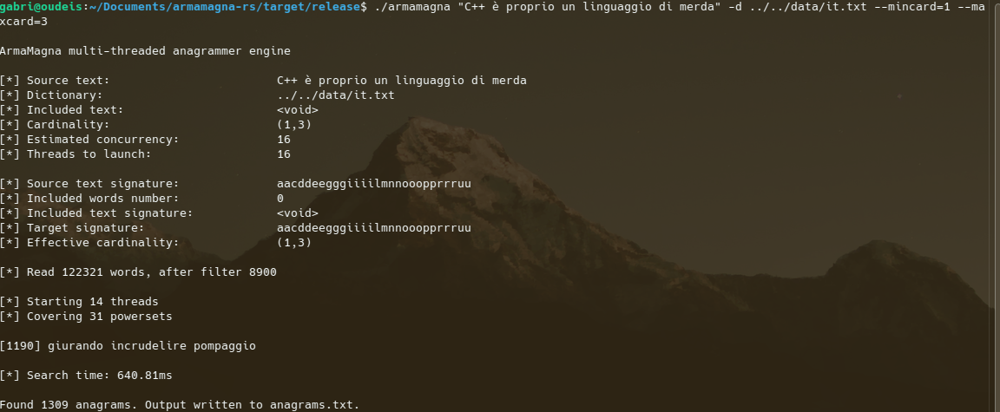

# ArmaMagna — Rust Port of the Original C++ Multithreaded Anagrammer



This is a **Rust port** of the original **ArmaMagna C++ anagrammer engine**.

🔗 **Original C++ implementation (GitHub):**  
https://github.com/merhametsize/armamagna

## Overview

The Rust port uses the exact architecture of the C++ version, while leveraging Rust’s memory safety, *fearless concurrency* etc etc.

## ✨ Features

* **Phrase anagram support:** Solves anagrams for entire phrases, ignoring spaces and punctuation within the input text.  
* **Filter by substring (-i/--incl):** Allows users to specify a word or phrase that **must** be present in the final anagram. This drastically reduces computation time.
* **Constraints:** Provides control over the anagram structure via two mandatory parameters:  
  * **Cardinality:** Minimum and maximum total number of words in the resulting anagram (--mincard, \--maxcard).  
* **Unicode normalization:** Uses the `unicode-normalization` package to normalize accented characters (e.g., é, è, ê are all treated as the base letter e).

## 🛠️ Build Instructions

### Prerequisites

* Rust development environment.

### Building

1.  **Clone the repository:**
    ```bash
    git clone https://github.com/merhametsize/armamagna-rs.git
    cd armamagna-rs
    ```

2.  **Build (Release Mode):**
    This preset applies `opt-level = 3` and `debug = false` for maximum performance.
    ```bash
    cargo build --release
    ```
    *The executable is located at `./target/release/armamagna`.*

3.  **Build (Debug Mode):**
    This preset enables overflow checks and debug symbols.
    ```bash
    cargo build --debug
    ```
    *The executable is located at `./target/debug/armamagna`.*

## 💻 Usage


```bash
./armamagna <text_to_anagram> -d <dictionary_path> --mincard <min_words> --maxcard <max_words> [optional_flags]
```

For example:
```bash
./armamagna "sator arepo tenet opera rotas" -d ../../data/it.txt -i "trota" --mincard 1 --maxcard 3 -t 4 [optional_flags]
```


